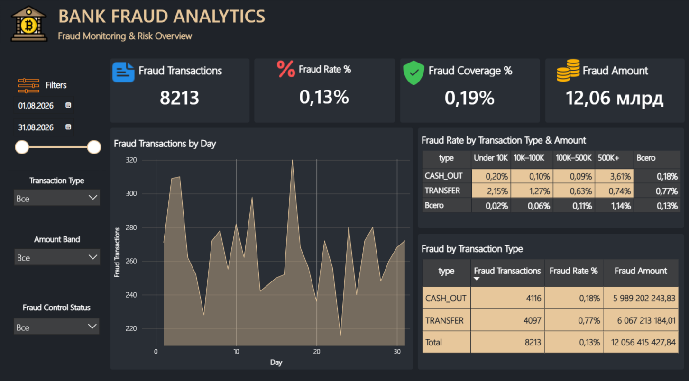
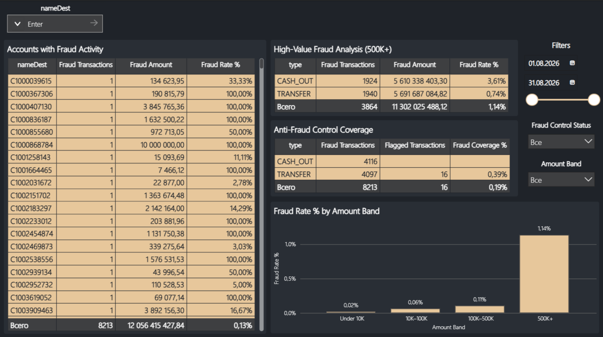
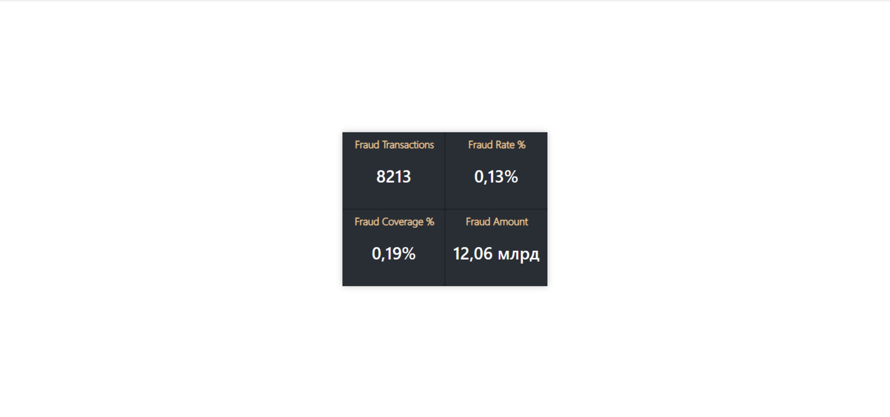

# 🏦 Bank Fraud Analytics
## 📌 О проекте
Цель проекта — проанализировать транзакции, определить основные зоны fraud-риска, оценить существующий anti-fraud контроль и на основе результатов предложить направления для его улучшения.
Я специально выстроил работу как приближенную к реальному аналитическому процессу:
**данные → SQL → проверка качества → подготовка данных → Power BI → анализ → бизнес-выводы → рекомендации.**

## 🏦 Бизнес-задача
Руководителю необходимо понять:
- насколько часто происходят мошеннические операции;
- какие типы транзакций наиболее рискованные;
- как связан размер операции с вероятностью fraud;
- где возникает основной финансовый ущерб;
- насколько хорошо текущий anti-fraud контроль выявляет мошеннические операции;
- какие направления стоит дополнительно контролировать.

**Главный вопрос проекта:**
Где сосредоточен основной fraud-риск и какие меры стоит принять банку для его снижения?

## 🎯 Цели анализа
В рамках проекта я поставил перед собой несколько задач:
1. Проверить качество исходных данных.
2. Подготовить данные для аналитики.
3. Провести первичный fraud-анализ в MySQL.
4. Определить наиболее рискованные типы операций.
5. Проверить зависимость fraud от суммы транзакции.
6. Оценить эффективность isFlaggedFraud.
7. Перенести результаты в Power BI.
8. Создать интерактивный аналитический Dashboard.
9. Сформулировать бизнес-выводы и рекомендации.

## 📊 Данные
Исходный датасет содержит 6 362 620 транзакций.
Основные поля, которые использовались в анализе:
| Поле | Описание |
|---|---|
| step | Час симуляции |
| type | Тип транзакции |
| amount | Сумма операции |
| nameOrig | Отправитель |
| nameDest | Получатель |
| oldbalanceOrg | Баланс отправителя до операции |
| newbalanceOrig | Баланс отправителя после операции |
| isFraud | Признак мошеннической операции |
| isFlaggedFraud | Признак срабатывания существующего fraud-контроля |

Типы операций:
- CASH_IN
- CASH_OUT
- DEBIT
- PAYMENT
- TRANSFER

Fraud-класс сильно несбалансирован: мошеннические операции являются небольшой частью общего количества транзакций.

## 🗄️ SQL-анализ
Первичную работу с данными я выполнял в MySQL / DBeaver.
Сначала я проверил структуру данных, распределение операций и fraud-класса.
После этого последовательно разобрал:
- общее количество транзакций;
- количество fraud-операций;
- fraud по типам транзакций;
- Fraud Rate;
- isFlaggedFraud;
- динамику fraud по времени;
- fraud по часам;
- fraud по диапазонам суммы;
- balance-поля;
- отправителей, связанных с fraud.

Для удобства анализа SQL-запросы разделил на отдельные файлы.
```text
SQL/
├── 01_data_profile.sql
├── 02_fraud_total.sql
├── 03_fraud_by_type.sql
├── 04_fraud_rate_by_type.sql
├── 05_flagged_fraud_coverage.sql
├── 06_fraud_top_hours.sql
├── 07_fraud_daily_dynamic.sql
├── 08_fraud_by_amount_band.sql
├── 09_balance_quality_check.sql
├── 10_create_fraud_clean.sql
├── 11_verify_fraud_clean.sql
└── 12_fraud_by_senders.sql
```

## 🧹 Проверка и подготовка данных
На этапе проверки качества я отдельно посмотрел на balance-поля.
Здесь обнаружилась важная особенность исходного датасета: значения балансов не всегда позволяют напрямую использовать простую арифметическую проверку как абсолютную истину.
Также при работе с денежными значениями возник вопрос точности хранения DOUBLE.
Поэтому я подготовил отдельный очищенный слой:
```text
fraud_raw → fraud_clean
```

В fraud_clean денежные поля были приведены к:
```text
DECIMAL(18,2)
```

После этого отдельно проверил созданную таблицу и уже её использовал как основу дальнейшей аналитики.
Подробнее проверки качества вынесены в:
Documentation/Data_Quality_Notes.md

## 📈 Power BI
После SQL-анализа подготовленные данные были перенесены в Power BI.
В Power BI я уже не просто воспроизводил SQL-результаты, а собрал аналитический отчёт, ориентированный на бизнес-пользователя.
Модель
Для работы с датами я создал отдельный календарь и связал его с транзакционными данными.
Поскольку step в исходном датасете представляет часы симуляции, я преобразовал его в календарную дату для анализа дневной динамики.
Отметить CALENDAR как таблицу дат не получилось, так как Date не уникален, а столбец должен содержать уникальные даты, но для моего проекта это не критично: мы анализируем симуляцию по step/часам, и наша связь CALENDAR[Value] → fraud_clean[step] уже работает.

## 🧮 Основные KPI
На главной странице я разместил четыре ключевых показателя:
- Fraud Transactions
- Fraud Rate %
- Fraud Coverage %
- Fraud Amount

Они позволяют руководителю сразу оценить масштаб fraud, его долю, покрытие существующего контроля и финансовый эффект.

# 📊 Dashboard
Отчёт состоит из двух страниц.
## 1. Executive Overview
Первая страница предназначена для быстрого руководительского обзора.
На ней находятся:
- 4 KPI-карточки;
- фильтр по дате;
- фильтр по типу транзакции;
- фильтр по Amount Band;
- фильтр по Fraud Control;
- динамика Fraud Transactions по дням;
- анализ fraud по типам операций;
- анализ по диапазонам сумм.

Я специально оставил страницу достаточно компактной, чтобы пользователь мог быстро понять общую картину, не погружаясь сразу в детали.

## 2. Fraud Analysis
Вторая страница предназначена для детального анализа основных зон fraud-риска.
Здесь я сосредоточился на:
- Fraud Rate по диапазонам сумм;
- анализе high-value операций 500K+;
- fraud activity по получателям (nameDest);
- оценке покрытия существующего anti-fraud контроля.

Фильтры синхронизированы между страницами, поэтому пользователь может менять контекст анализа без повторной настройки каждого визуала.

## 3. Tooltip
Я также добавил отдельную Tooltip-страницу.

При наведении на точку графика пользователь может получить дополнительную информацию.

# 📌 Ключевые результаты
## 1. Высокий риск крупных операций
Транзакции 500K+ имеют самый высокий Fraud Rate и одновременно создают наиболее существенный финансовый риск.
Это делает high-value операции отдельной зоной для anti-fraud мониторинга.
## 2. Основной fraud сосредоточен в CASH_OUT и TRANSFER
Наибольшее количество fraud-операций приходится на:
- CASH_OUT — 4 116
- TRANSFER — 4 097

При этом TRANSFER показывает особенно высокий уровень риска относительно общего количества операций этого типа.
## 3. Текущий isFlaggedFraud имеет очень низкое покрытие
Всего 16 из 8 213 fraud-транзакций были отмечены текущим механизмом isFlaggedFraud.
Это соответствует примерно 0,19%.
Получается, что существующее правило охватывает только очень небольшую часть обнаруженного fraud.
## 4. Fraud-риск неодинаков между сегментами
Fraud Rate существенно меняется в зависимости от:
- типа операции;
- размера транзакции.
Поэтому единый контроль для всех операций будет менее эффективным, чем сегментированный risk-based подход.

# 💡 Рекомендации
На основании анализа я бы предложил банку:
## 1. Усилить контроль операций 500K+
Для крупных операций можно использовать:
- дополнительную проверку;
- более строгие пороги мониторинга;
- отдельные anti-fraud правила.
## 2. Приоритизировать TRANSFER и CASH_OUT
Особое внимание стоит уделять операциям этих типов, особенно если одновременно выполняется условие высокой суммы.
## 3. Пересмотреть isFlaggedFraud
Текущее покрытие слишком низкое, поэтому существующие правила стоит дополнить более широкими risk-based сценариями.
## 4. Перейти к сегментированному контролю
Anti-fraud правила должны учитывать не только сам факт транзакции, но и сочетание факторов:
тип операции + сумма + другие признаки риска.
## 5. Ввести отдельный контроль high-value exposure
Для операций 500K+ имеет смысл использовать отдельный KPI и систему мониторинга финансовой подверженности fraud.

# Итог
Главный вывод проекта для меня заключается в том, что само количество fraud-операций не даёт полной картины риска.
Гораздо важнее понять:
где именно возникает риск, какой финансовый ущерб он создаёт и насколько эффективно текущие правила его обнаруживают.

В нашем случае основное внимание стоит направить на TRANSFER, CASH_OUT и high-value операции, а существующий isFlaggedFraud — рассматривать как недостаточный для полноценного покрытия fraud.

# Используемый стек
- MySQL
- DBeaver
- Power BI
- Power Query
- DAX
- Git / GitHub

Python в этой версии проекта не использовался, так как для поставленной задачи SQL и Power BI было достаточно.

# 📁 Структура проекта
```text
Bank-Fraud-Analytics/
│
├── README.md
│
├── SQL/
│   ├── 01_data_profile.sql
│   ├── 02_fraud_total.sql
│   ├── 03_fraud_by_type.sql
│   ├── 04_fraud_rate_by_type.sql
│   ├── 05_flagged_fraud_coverage.sql
│   ├── 06_fraud_top_hours.sql
│   ├── 07_fraud_daily_dynamic.sql
│   ├── 08_fraud_by_amount_band.sql
│   ├── 09_balance_quality_check.sql
│   ├── 10_create_fraud_clean.sql
│   ├── 11_verify_fraud_clean.sql
│   └── 12_fraud_by_senders.sql
│
├── Power BI/
│   └── Bank_Fraud_Analytics.pbix
```

# 📷 Dashboard Preview

## Executive Overview



## Fraud Analysis



## Tooltip — Fraud Details



